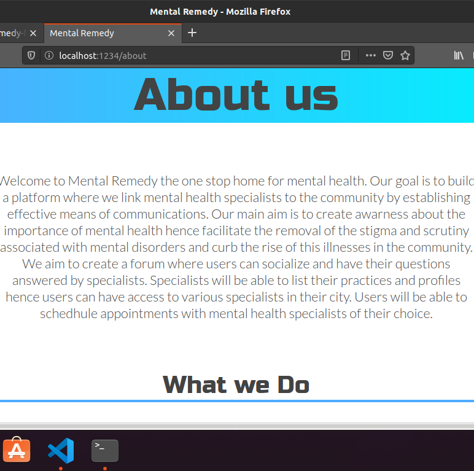

# Mental Remedy

A Product for findind innovative ways that can link mental health specialists to your community.

## About

Welcome to Mental-Remedy, team-158 project based on the sustainable development goals solution to promoting good health and well-being by linking mental health specialists to our community.

## Why

Mental health problems appear to be increasing in importance in Africa. Between 2000 and 2015 the continent's population grew by 49%. As Africa's population is expected to double over the next three decades, the pressures on young people in particular, who across the region are already struggling to earn a livelihood in highly competitive labour markets, are likely to ratchet up. Many will experience psychological problems as they fail to realise their ambitions, and some will turn to substance misuse as a means of alleviating their frustration.

Increased attention to mental health by governments, researchers, and journals is therefore essential.This project tackles the third sustainable development goal of good health and well-being by linking mental health specialists to our communities. Mental illness is stigmatized in our communities which has reduced health-seeking behaviour among those affected. People fail to realize that mental illness is an health condition of the mind which changes thinking, emotions and behaviour. With proper treatment, mentally ill individuals can return back to their communities and contribute meaningfully to the society. Our project aims to facilitate the process of getting health care at the community level.

## Usage

How would someone use what you have built, include URLs to the deployed app, service e.t.c when you have it setup

## Setup

Install `npm` or `yarn` if you dont have any of them already installed. We recommend Yarn though.

After clonning the repo to your local machine and moving into the cloned folder, Run `yarn install` to get started by installing dependencies.

`src/index.js` is the entry to the project and source code should go into the `src` folder.

All tests should be written in the `**tests**' folder. There's a sample in there.

This starter uses [Parcel](https://parceljs.org/getting_started.html) as the bundler. It is much simpler that WebPack and the others

### Hints

-   Run `npm install` or `yarn install` to get started. We'll assume you are using Yarn.
-   Install additional dependencies: `yarn add <dependency-name> [-D]`
-   Run tests: `yarn test`
-   Run tests with test coverage info: `yarn test:cover`
-   Check the codebase for proper syntax and formatting compliance: `yarn lint`
-   Run your app in local dev mode: `yarn start`. This puts the bundled app in a `dist` folder, set up a local web server at localhost:1234, and continues to watch for your code changes which it syncs with the local server. This means if you loaded the app in a browser, it will auto-refresh as you code along. Feel free to use whatever bundler best meets your needs. Parcel was only added as a sample and for those looking for a simple but effective solution to the hassle of bundlers.

## Authors

Abdulwadud Haji - [a relative link](https://github.com/art-abdulwadud) - Team Technical Lead, Frontend Lead, UI/UX Designer

## Contributing

If this project sounds interesting to you and you'd like to contribute, thank you!
First, you can send a mail to buildforsdg@andela.com to indicate your interest, why you'd like to support and what forms of support you can bring to the table, but here are areas we think we'd need the most help in this project :

1.  area one (e.g this app is about human trafficking and you need feedback on your roadmap and feature list from the private sector / NGOs)
2.  area two (e.g you want people to opt-in and try using your staging app at staging.project-name.com and report any bugs via a form)
3.  area three (e.g here is the zoom link to our end-of sprint webinar, join and provide feedback as a stakeholder if you can)

## Acknowledgements

Did you use someone else’s code?
Do you want to thank someone explicitly?
Did someone’s blog post spark off a wonderful idea or give you a solution to nagging problem?

It's powerful to always give credit.

## LICENSE

MIT
